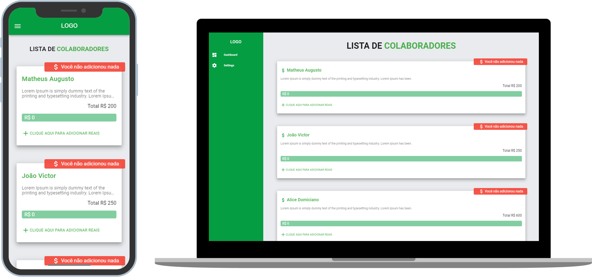

<h1 align="center">
  TESTE ÂNIMA EDUCAÇÃO
</h1>

   
   

  
  
  

  

## ◾ Objetivo do projeto

Sistema desenvolvido para o teste da empresa Ânima Educação, o mesmo foi feito seguindo o style guide do Vue.js

O ambiente esta configurado com deploy automatico utilizando a ferrtamenta [Netlify](https://www.netlify.com/) 

#### Visualizar o teste: [teste-anima.com.br](https://cranky-cori-097d1f.netlify.app/#/)

## ◾ Tecnologias utilizadas

Esse projeto foi desenvolvido com as seguintes tecnologias:

- [VUE.JS](https://br.vuejs.org/) - Framework progressivo utilizado para construção de sistemas Web;
- [VUETIFY](https://vuetifyjs.com/en/) - Blibioteca de estilização para componentes do Vue.js;
- [AXIOS](https://github.com/axios/axios) - Blibioteca utiliada para requisições HTTP.

## ◾ Licença

Esse projeto está sob a licença MIT.
